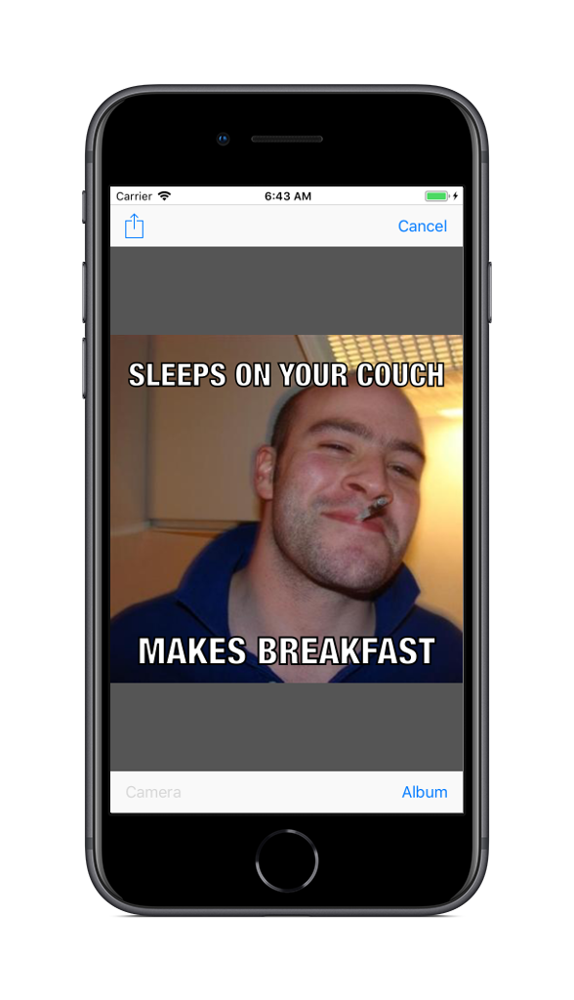

# Meme Me V1

## Introduction
**Meme Me V1** is an iOS app that allows you to take a picture from your camera or library and overlay text on it to make a meme. This version focuses on just the Meme Editor.

## Usage
* Make a meme very easily with a photo in your library or your camera.
* Once your done you can save the image to your photo library or start sharing it.

## Screenshots

